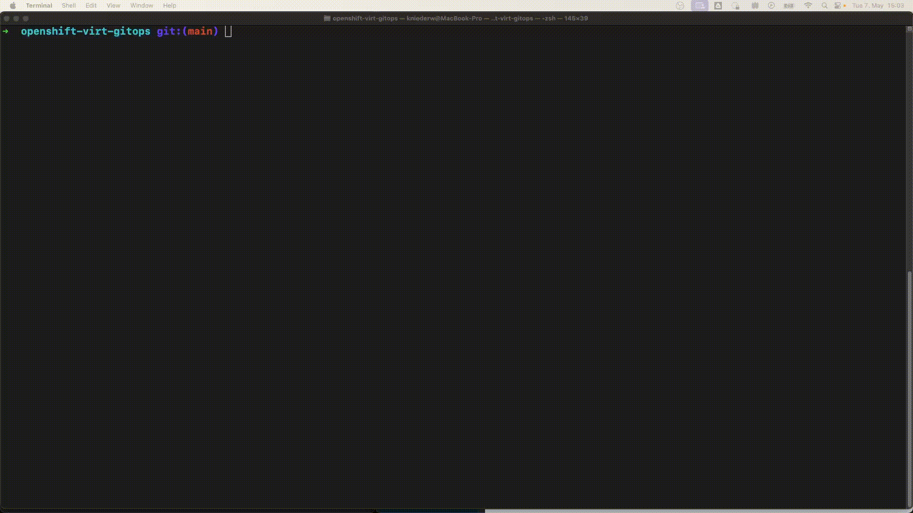
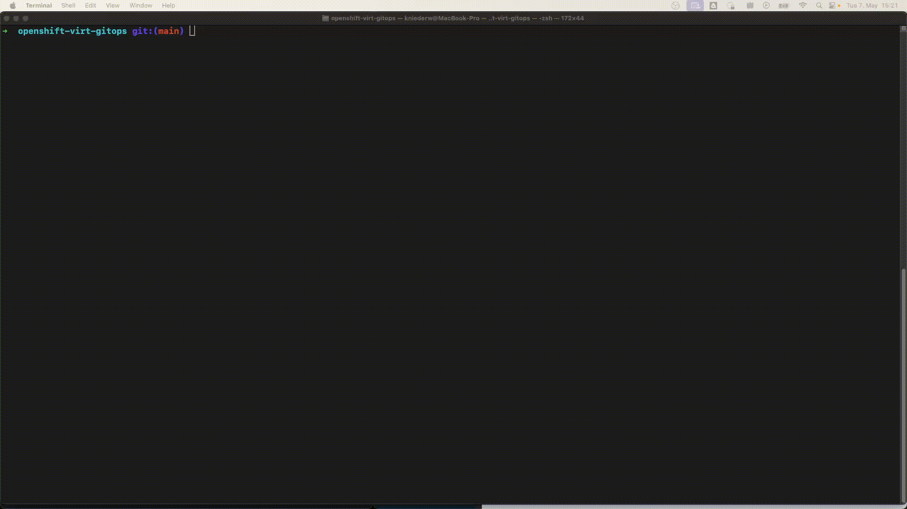
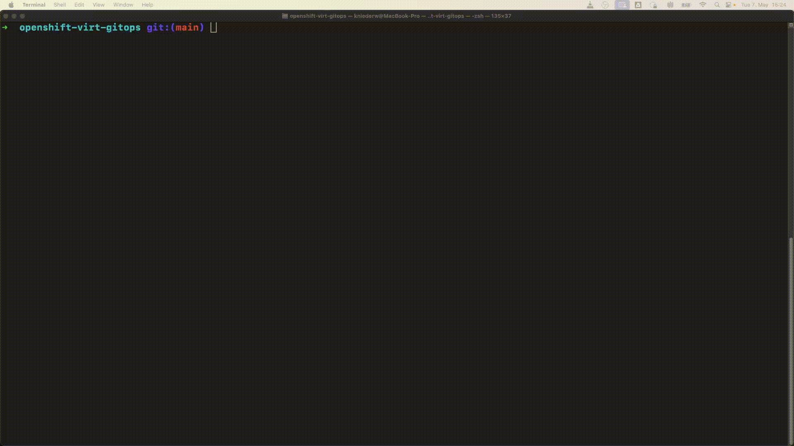

# OpenShift Virtualization and OpenShift GitOps
Managing virtual machines (VMs) of [OpenShift Virtualization](https://docs.openshift.com/container-platform/4.15/virt/about_virt/about-virt.html) with [OpenShift GitOps](https://docs.openshift.com/gitops/1.12/understanding_openshift_gitops/about-redhat-openshift-gitops.html).

# Run the Demo

## Understanding the outcome

This demo will create four `namespaces`
- `dev-demo-db`  -> Database for development
- `prod-demo-db` -> Database for production
- `dev-demo-vm`  -> VMs for development
- `prod-demo-vm` -> VMs for production

These `namespaces` (and other resources) are deployed via [OpenShift GitOps](https://docs.openshift.com/gitops/1.12/understanding_openshift_gitops/about-redhat-openshift-gitops.html), which is based on the open source project [Argo CD](https://argoproj.github.io/cd/). The namespaces, i.e. multi-stage environments, are managed via [`kustomize`](https://kustomize.io/).
The overlay structure is as follows:
```sh
tree
.
├── demo-db
│   ├── applicationset-demo-db.yaml
│   └── kustomize
│       ├── base
│       │   ├── deployment.yaml
│       │   ├── kustomization.yaml
│       │   └── service.yaml
│       └── overlays
│           ├── dev
│           │   └── kustomization.yaml
│           └── prod
│               └── kustomization.yaml
└── demo-vm
    ├── applicationset-demo-vm.yaml
    └── kustomize
        ├── base
        │   ├── kustomization.yaml
        │   ├── route.yaml
        │   ├── service.yaml
        │   ├── virtualmachine-1.yaml
        │   └── virtualmachine-2.yaml
        └── overlays
            ├── dev
            │   └── kustomization.yaml
            └── prod
                └── kustomization.yaml
```

The database `namespaces` are pretty similar, as they just have a `Deployment` and `Service`, each.

The VM `namespaces` hold the following base configuration:
- Virtual machine 1 -> First web server VM
- Virtual machine 2 -> Second web server VM
- `service`         -> Enables the connection to all VMs 
- `route`           -> Enables HTTP(S) traffic to the VMs via the `service`
The `namespaces` differ in the overlays, because the development environment `dev-demo-vm` has the second VM stopped, as there is no need for it.

## Provision the setup
```sh
# GitOps Operator
oc apply -f operators/gitops/operator-gitops.yaml

# OpenShift Virtualization
oc create -f operators/virtualization/operator-virtualization.yaml
# HyperConvergedController CR
oc apply -f operators/virtualization/hyperconverged.yaml

# Obtain GitOps password
oc get secret/openshift-gitops-cluster -n openshift-gitops -o jsonpath='{.data.admin\.password}' | base64 -d

# Create ApplicationSets
oc apply -f applicationsets/demo-vm/applicationset-demo-vm.yaml
oc apply -f applicationsets/demo-db/applicationset-demo-db.yaml

# Apply permissions
oc adm policy add-role-to-user admin system:serviceaccount:openshift-gitops:openshift-gitops-argocd-application-controller -n dev-demo-vm
oc adm policy add-role-to-user admin system:serviceaccount:openshift-gitops:openshift-gitops-argocd-application-controller -n prod-demo-vm
oc adm policy add-role-to-user admin system:serviceaccount:openshift-gitops:openshift-gitops-argocd-application-controller -n dev-demo-db
oc adm policy add-role-to-user admin system:serviceaccount:openshift-gitops:openshift-gitops-argocd-application-controller -n prod-demo-db
```


## Start/Stop a VM via Git

VMs can be managed via Git.

### Start VM


### Stop VM


## Demonstrate route to production VMs:
```sh
oc get vmi -n prod-demo-vm -o custom-columns=VirtualMachineInstance:.metadata.name,Phase:.status.phase
VirtualMachineInstance   Phase
prod-demo-vm-1           Running
prod-demo-vm-2           Running

endpoint=$(oc get route -n prod-demo-vm prod-my-route  -ojsonpath='{.spec.host}')
for i in {1..10}; do curl http://$endpoint; done
This is demo VM 1 :)
This is demo VM 1 :)
This is demo VM 1 :)
This is demo VM 2 :)
This is demo VM 1 :)
This is demo VM 2 :)
This is demo VM 2 :)
This is demo VM 1 :)
This is demo VM 2 :)
This is demo VM 2 :)
```



## Connect from the VM to the database inside a container:
```sh
oc -n dev-demo-db get svc
NAME        TYPE        CLUSTER-IP     EXTERNAL-IP   PORT(S)    AGE
dev-my-db   ClusterIP   X.X.X.X         <none>        3306/TCP   133m

virtctl -n dev-demo-vm console dev-demo-vm-1

mysqlshow -u developer -pdeveloper -h dev-my-db.dev-demo-db.svc.cluster.local
+--------------------+
|     Databases      |
+--------------------+
| information_schema |
| performance_schema |
| sampledb           |
+--------------------+

exit
```



## Connect from the database pod/container to the VM service:
```sh
endpoint=$(oc get route -n dev-demo-vm dev-my-route  -ojsonpath='{.spec.host}')
dbpod=$(oc -n dev-demo-db get pods -l=app=my-db -oname)
oc -n dev-demo-db exec -it  $dbpod -- curl http://$endpoint
This is demo VM 1 :)
```


